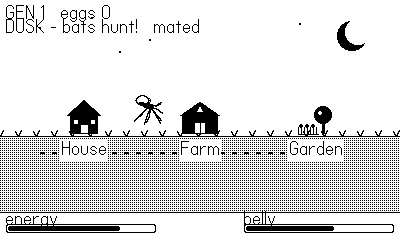

# Blood and Whine

A 1-bit Playdate game about a mosquito trying to continue her bloodline.
You drink **nectar to survive** and **blood to breed** — and every host can
kill you. Play the whole mosquito lifecycle across five stages, tune your
wingbeat to a mate, lay your clutch in a rain-puddle before it dries, then
loop into the next generation with the mutations your line has earned. The
full design is in [DESIGN.md](DESIGN.md).

## Play it

Open `Whine.pdx` in the Playdate Simulator, or sideload it at
<https://play.date/account/sideload/>. To build from source, see
[Development](#development).

**Status: v0.6.** The lifecycle plays end to end — egg raft, aquatic
larva (dodging predatory larvae in cleaned-up water), pupa, and the adult
overworld — with a two-oscillator courtship where the wah-wah beat slows to
silence as you tune onto the male (real mosquito acoustics), an
overworld map that drops you into House / Farm / Garden screens, an
actively-evasive male you can also *play as* on a bonus run, per-stage
clock-driven music, and a persistent lineage: fertile eggs bank toward
mutations (Quiet Wings, Spray Gland, Fast Wings, Big Reserve) that carry
across generations and play sessions.

## The loop

- **Nectar** fuels your wings — safe, but earns no eggs.
- **Blood** is the only path to a clutch — every host swats, sprays or
  eats you.
- **Water** (mostly after rain) is the only place you can *lay* what you
  carry, and it evaporates.

Every moment is survive (nectar, safe, no progress) vs. progress (blood,
deadly, the only way forward). Eggs are your score and your bloodline.

## Controls

- **✛** — fly / swim / steer the raft.
- **Ⓐ** — enter a map location, court a male you've reached, lay a clutch
  at the pond.
- **Ⓑ** — leave a location back to the overworld map.
- **Crank** — your proboscis: work it to drink blood from a host, and to
  fly the broken-wing lure. In courtship, crank to tune your wingbeat
  frequency onto the male's until the beat falls silent and you lock on.
- Stay **still** after dusk — bats home on your whine only while you're
  moving.

## Stages

1. **Egg raft** — keep the raft off the drying edge until it hatches.
2. **Larva** — dive for food, surface for air, dodge predatory larvae.
3. **Pupa** — bob and wait to emerge; too much thrashing draws danger.
4. **Adult** — the core loop: fly the map, feed at House/Farm, refuel and
   lay in the Garden, court a mate, outlast dusk bats.
5. **Next generation** — your line inherits its earned mutations.

## Development

- `make` → `out/Whine.pdx`; `make smoke` → instrumented build.
- `tools/smoke.sh` — headless Simulator run driven by an autopilot that
  tours every stage, with a heartbeat + first-error datastore and
  frame-stamped screenshots.

MIT licensed — see [LICENSE](LICENSE).
